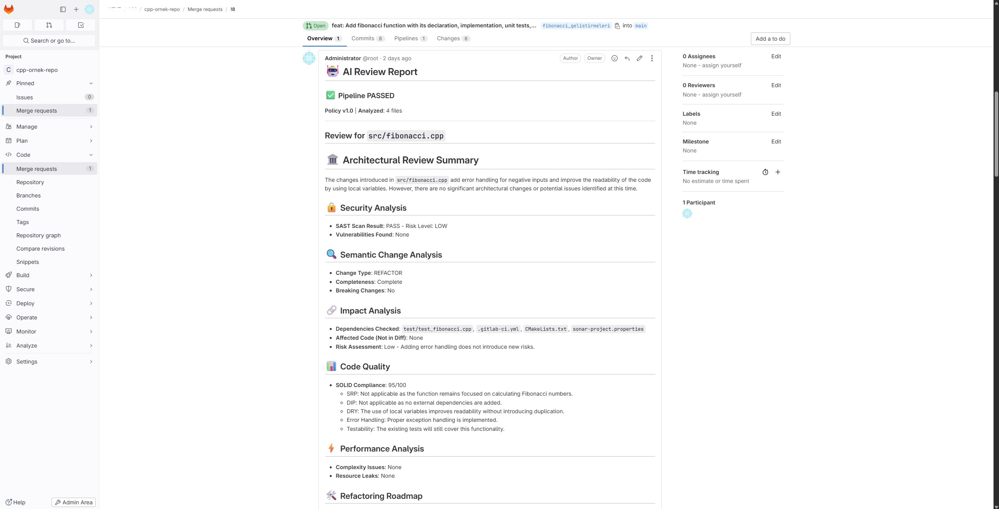

# Enterprise AI Code Review Agent
**Codebase-Aware Impact Architect**

An AI code review agent for CI/CD pipelines. It triages a merge request before
spending tokens on it, runs static analyzers over the changed files, asks an LLM
for an architectural review, and turns the result into a pipeline decision.

> **Status: 2.23.1.** Rebuilt from an imported prototype across twenty-nine
> levels of work. 59 defects were found and recorded and all 59 are now fixed —
> the last deferred one closed in Level 7. 2572 tests at 94 % coverage; lint,
> formatting, types, tests, a dependency audit with an empty ignore list and a
> review-quality floor all gate on CI. Levels 7-11 closed a further nineteen
> gaps found by comparing against a sibling implementation; Level 12 started a
> second roadmap, sourced from what the work is expected to do rather than from
> what was wrong, and Level 13 spent its first measurement on two real defects
> before adding retrieval.
> What each level did, and what it found, is in
> [`docs/roadmap/`](docs/roadmap/README.md).

---

## 🚀 Capabilities

### 🧠 1. Smart Review Triage
Classifies each changed file before any LLM call:
- **SKIP** — file types excluded by policy (docs, lock files).
- **AUTO_APPROVE** — comment-only, whitespace-only, or minimal non-logic changes.
- **CRITICAL** — security-sensitive patterns or public API removals.
- **QUICK_SCAN / FULL_REVIEW** — chosen by the size of the change.

### 🔍 2. Static analyzers
- **Semantic change analysis** — AST-based classification into `REFACTOR`,
  `FEATURE`, `BUGFIX`, `BREAKING_CHANGE`, with a risk score.
- **Dependency impact tracking** — forward imports and reverse references, plus
  a two-level ripple-effect trace, so code outside the diff is considered.
- **SAST** — SQL injection, XSS, command injection, path traversal, hardcoded
  secrets, weak crypto and insecure deserialisation, mapped to CWE and OWASP
  Top 10.
- **Code quality** — SOLID violations, cyclomatic complexity, duplicate blocks,
  testability and error-handling analysis.
- **Performance** — nested-loop complexity, recursion, N+1 query patterns and
  unclosed resources.

### 🛡️ 3. Policy and gate
- Rules are declared in `review_policy.yaml` — skip patterns, banned patterns,
  secret patterns, quality thresholds and pipeline behaviour. Thresholds are
  enforced: raising `max_class_methods` changes what is reported.
- Every reviewed file is analysed **unconditionally**, not only when the model
  asks for it, and the findings drive the decision.
- The **review gate** turns findings and the review report into `PASS`, `WARN`
  or `FAIL`. Findings block; the model's prose warns. Each reason names its
  source, so an analyzer's verdict is distinguishable from the model's opinion.
- `gate.blocking_severity` sets how severe a finding has to be to fail a
  pipeline. It defaults to `critical`.

### 🔒 4. Defences against the content under review
The diff is written by whoever opened the merge request, so it is treated as
hostile input in five places
([ADR 0010](docs/adr/0010-untrusted-input-defences.md)):

- **A declared trust boundary.** The diff and the file content are wrapped in
  `<untrusted_diff>` / `<untrusted_file_content>`, both tag forms escaped
  inside the content, and the system prompt opens by declaring everything
  inside them to be data rather than instructions.
- **Confinement.** Every path is resolved against the checkout and refused if
  it lands outside, including through `..` and symlinks.
- **A deny-list and a read budget.** `.env`, `id_rsa`, `*.pem`, `*.key` and
  anything under `.git/` are refused at any depth, and listings omit them
  rather than naming them. A per-review total read budget means an
  exfiltration cannot proceed one ordinary file at a time.
- **Fixed-string search.** `grep` runs with `-F` after `--`, bounded, with
  credential files excluded, so a model-supplied pattern is data rather than a
  program.
- **Redaction.** The review text is masked on the way out — the values of the
  secrets this process holds first, then known secret shapes.

**A refused access becomes a `CRITICAL` finding**, so an injection attempt can
fail the pipeline rather than merely be mentioned in the report.

### 🔇 5. Suppressing a false positive
Every static analyzer produces them; one that does not is not looking hard
enough. Without a way to say "this one is wrong", a team's only options are to
turn the rule off or stop the gate blocking — so suppression exists to keep the
narrow answer available
([ADR 0013](docs/adr/0013-suppression-is-narrow-and-counted.md)):

```python
verify = False  # review-ignore: SAST.INSECURE_HTTP - reached only behind an env flag

# review-ignore: QUALITY.DRY - generated code, regenerated on every build
def generated_thing(): ...

# review-ignore-file: SAST.* - vendored third-party source
```

Scope is one line — or the line *after* a standalone comment — or one file.
`SAST.*` covers a namespace; a bare `*` is refused, because suppressing
everything is the second off-switch arriving through another door. The reason
is captured, and the report states how many findings were suppressed, where,
and why, naming any written without one.

### 📈 6. Metrics and logging
- The whole review is exported as OpenMetrics text for GitLab's `metrics`
  report: files and lines analysed, findings per severity, triage decisions,
  gate result, total and slowest duration — each with `# HELP` and `# TYPE`.
- Diagnostics go through `logging`. `LOG_LEVEL` sets verbosity and
  `LOG_FORMAT=json` emits one JSON object per record for an aggregator.
- A file the reviewer cannot process is reported as *not reviewed* rather than
  ending the run or passing silently.

### 🧠 7. Token-aware memory
`SmartMemoryStrategy` keeps findings in priority buckets, never summarises
`SECURITY` or `BREAKING` insights, and compresses lower-priority context first.

### 🔎 8. Retrieval over the repository
- The checkout is chunked by syntax tree — every function, class and method,
  with line windows as the fallback — then indexed twice: **BM25** over
  tokenised identifiers, and **cosine** over embeddings.
- The two rankings are fused by **reciprocal rank** rather than by score, then
  reduced by **maximal marginal relevance** so the context is not three copies
  of one function.
- Retrieved code reaches the prompt inside `<untrusted_repository_context>`,
  under the same trust boundary as the diff. It lives in the checkout, and the
  checkout is what the merge request changed.
- `search_related_code` exposes the same index to the agent, for questions the
  automatic query did not cover.
- Everything is **offline and deterministic**: the default embedding hashes
  tokens, so there are no weights to download and no endpoint to fail.
  `EmbeddingModel`, `LexicalIndex` and `VectorIndex` are ports — a trained
  model or a hosted vector database is one constructor call.
- **Retrieval never blocks.** An index that cannot be built costs the prompt
  its context and nothing else
  ([ADR 0015](docs/adr/0015-retrieval-is-hybrid-local-and-untrusted.md)).

### 👥 9. A committee, not one agent
Four specialists, each with its own prompt, its own tool catalogue and its own
share of the file's budget:

| Agent | Runs when | Gets |
|---|---|---|
| 🏛️ **Architecture** | always — it is the generalist and owns the summary | semantic + quality tools |
| 🔒 **Security** | a `SECURITY` finding was reported | SAST + grep |
| ⚡ **Performance** | a `PERFORMANCE` finding was reported | the performance analyzer |
| 🔗 **Dependency** | a `DEPENDENCY` finding, or the file is a manifest | imports, references, ripple |

- **Routing is derived from the analyzers' findings**, not from a model. Two
  conditionals make that decision correctly, reproducibly and for free.
- **Budget is split by weight** and sums exactly to the total; security's share
  is the largest, and the split appears in the report's footer.
- **Tools are narrowed, not requested.** An agent told in English not to use a
  tool sometimes uses it; one never offered it cannot.
- **A specialist may hand off once**, with a written reason, and the depth is
  structural — the second round runs where every request is refused. Refusals
  are recorded in the report.
- **One agent failing costs one section.** The rest still run, and the failure
  is stated rather than omitted.
- Per-agent runs, failures and tool calls reach the metrics export.
  `--single-agent` gives you the one-call-per-file behaviour of earlier levels
  ([ADR 0017](docs/adr/0017-an-orchestrator-of-specialists-not-a-framework.md)).

### 📦 10. A deployable artefact
- A **multi-stage image**: the runtime carries the virtual environment, the
  package and `git` — no compiler, no `uv`, no source tree, no `.git`. It runs
  as uid `10001` under `gunicorn`, not `wsgiref`.
- **Kubernetes manifests** in `deploy/kubernetes/`: namespace, config, an
  example secret with placeholder values, a deployment and a service. Requests
  and limits, `runAsNonRoot`, `allowPrivilegeEscalation: false`,
  `readOnlyRootFilesystem`, every capability dropped.
- **The manifests are tested.** `tests/unit/test_deployment_manifests.py`
  parses both files and asserts every claim — including that the probe paths
  are paths `ReviewApi.ROUTES` actually serves, so a renamed endpoint breaks a
  test rather than a cluster
  ([ADR 0021](docs/adr/0021-a-deployment-that-is-tested.md)).
- **`/readyz` answers from real checks** now: the forge token, the model
  endpoint, a policy that loads, a workspace that exists. Every failure is
  reported at once, and a reason names the setting and never its value.
- **`SIGTERM` drains — under both entry points.** The server stops, the review
  in flight gets a bounded wait, and the log says which of "finished" and "gave
  up" happened. Under `gunicorn` the signals belong to gunicorn, so the drain
  is an `atexit` handler registered by `create_app`; the self-review found that
  claim tested only against the entry point nobody deploys.
- **One replica, and no autoscaler.** The queue is in memory: two replicas do
  not share it. Shipping an HPA would be a bug delivered as configuration.

### 🌐 11. A service, not only a job
```
POST /reviews          → 202 + id + Location   (200 if already in flight)
GET  /reviews/{id}     → state, verdict, exit code, trace id
POST /webhooks/gitlab  → X-Gitlab-Token verified before the body is read
GET  /healthz          → this process is running
GET  /readyz           → it can accept work (no third party is called)
GET  /metrics          → OpenMetrics
```

- **Idempotency is keyed on the commit**, not the merge request: a push is a
  new review, and collapsing the two would silently drop it. `Idempotency-Key`
  is honoured too.
- **Authentication is asserted over the route table**, which is data — a route
  added later is covered by construction. The only open routes are the two
  probes, and a test says so.
- The status endpoint **never returns the comment**: it may quote the diff, and
  the merge request already has it.
- The webhook **refuses everything with no secret configured**, compares in
  constant time, and answers `204` to events it does not care about — an
  endpoint that errors on those gets disabled by whoever watches the delivery
  log.
- **No framework.** A WSGI application: `gunicorn code_reviewer.serve:create_app`
  in a container, `wsgiref` on a laptop, and forty-eight tests that call it with
  a dictionary ([ADR 0020](docs/adr/0020-a-wsgi-application-not-a-framework.md)).
- It **refuses to start without `REVIEW_API_TOKEN`**, and binds loopback by
  default.

### ⚡ 12. The committee runs concurrently
- The four specialists reviewing one file run **at once**, bounded by
  `--concurrency N`. `1` selects the sequential runner outright, which is the
  behaviour of every level before 17.
- **Order is by plan, not by completion.** The report, the per-agent accounting
  and the verdict are byte-identical either way — asserted as equalities, which
  is the only honest way to claim a concurrency change changed nothing else.
- A specialist that hangs is **abandoned** at its timeout, reported as failed,
  and the others still appear. Python cannot kill a thread, so the pool is
  marked tainted and replaced rather than reused — saying "cancelled" would be
  a lie.
- Threads, not `asyncio`: the two clients in the critical path are synchronous,
  and going async would turn every port in the repository `async` to await
  them ([ADR 0019](docs/adr/0019-threads-behind-a-port.md)).
- The tracer's stack is per thread and a worker binds to the span that
  submitted it, so the trace comes out the same shape it would sequentially.

### 🔬 13. A trace of the whole review
One review produces one tree: the run, each file, each agent, each tool call,
each retrieval, each memory access.

```
1     review                        [merge_request=42 project=17]
1.1   file      src/app.py          900 ms (self 120 ms)
1.1.1 analysis  static analysis      80 ms
1.1.2 retrieval related code         40 ms  [chunks=4]
1.1.3 agent     security            400 ms  [budget=4000 tool_calls=3]
1.1.3.1 model   invoke              310 ms
```

- **Self time, not duration.** A parent's duration includes everything below
  it; each span reports its own share, totalled per kind — so "40 % of this
  review was tool calls" is a number rather than a guess.
- **Every log record inside a review carries `trace_id` and `span_id`**, in
  both the human and the JSON format. That is the join between a log line and
  the trace, and what makes two interleaved reviews separable.
- **Attributes are identifiers, never content.** A path, a rule, an agent, a
  count, a budget — never a diff, a file's contents or a model's prose.
  Enforced by a length cap and by a test that runs a real review whose diff
  contains a credential-shaped string.
- **Nothing is lost to bad input.** An orphan attaches to the root, a cycle is
  broken, a second root is adopted — each recorded as an anomaly.
- Recording is always on; `--trace-path` writes the JSON. **No OpenTelemetry**
  ([ADR 0018](docs/adr/0018-a-trace-of-our-own.md)) — the port is there so that
  can change without the review path changing.

### 🧾 14. A memory of this project
- What a review found survives it. `.review-memory.json` in the checkout holds
  what each rule has done in each file: how many times, since when, and — for a
  `review-ignore` — the reason somebody wrote.
- The next review is told what is known about the files it is looking at, and
  the report marks findings this project has **seen before**, with the count
  and the date.
- **Only identifiers are stored.** Rule, path, severity, dates, counts. Never
  an evidence line, never a diff excerpt, never model output: a file that
  accumulates contributor text is a stored injection with a long half-life, and
  a credential store nobody declared.
- **Memory informs; it never decides.** No recollection changes a severity, a
  gate result or an exit code — asserted by running the same review twice, with
  a 99-sighting history and with none, and requiring an identical verdict
  ([ADR 0016](docs/adr/0016-memory-informs-and-never-decides.md)).
- It forgets: salience halves every 30 days, and below a floor a fact is
  dropped. `--no-memory` turns the whole thing off; `--memory-path` moves it.
- A fresh CI clone has no history unless the file is committed or cached. That
  degrades quietly to the behaviour of every earlier level, which is correct —
  and worth knowing before concluding the feature does nothing.

### 🎯 15. Measured review quality
- `ai-code-review-eval` grades the analysis suite against an annotated dataset
  (`evaluation/cases/*.yaml`) and reports precision, recall and F1 — overall
  and per rule.
- A floor on each is enforceable in CI. Below it the command exits `1`; when
  the measurement could not be taken at all — an unreadable case, a missing
  fixture, an analyzer that raised — it exits `2`, because a pipeline has to be
  able to tell a bad score from a broken harness.
- Findings a case does not grade are **counted and named**, never dropped, so
  narrowing what is graded cannot quietly improve the score.
- The current baseline is precision, recall and F1 all `1.00 [0.84, 1.00] over
  20 graded findings` ([baseline](docs/roadmap/level-12/baseline.md)). The
  interval is the honest form of the number: twenty of twenty is consistent with
  a real rate of 0.84, and until Level 25 this was printed exactly the way a
  measurement a hundred times larger would be. The committed floors are applied
  to the **lower bound**, which is why they read 0.80 rather than 0.95 — a
  stricter claim, not a weaker one
  ([ADR 0027](docs/adr/0027-a-score-that-states-its-own-uncertainty.md)).
- Level 12 opened at recall 0.89 — the gap was a real defect the dataset
  recorded rather than annotated away, and Level 13 closed it.

### 🛠️ 16. A fix you can apply
- **Six deterministic recipes of thirty-four emittable rules — 18 %, and the
  number is printed** rather than counted by hand. The thirty-two without one
  each carry a recorded reason, and a rule with neither is a red test.
- Each reads the line its finding named and **declines when the pattern is not
  there**: a URL built from a variable, a bare `except` that re-raises, an
  `open` call with a shape the recipe cannot read.
- **A suggestion is a set of edits**, non-overlapping and applied bottom-up, so
  a fix needing `import secrets` at the top and a call rewritten in the middle
  is expressible ([ADR 0028](docs/adr/0028-a-suggestion-is-a-set-of-edits.md)).
  Each edit is its own note saying which part of the whole it is — a suggestion
  block must include the note's own line, so disjoint edits cannot share one.
- **Validated by applying it.** The edit is applied in memory and the result
  re-parsed; one that would leave the file unparseable is discarded rather than
  published.
- **Only a deterministic producer may author one.** An agent-produced finding
  never yields an applicable edit, for the reason a model may not block a merge.
- **Posted as diff notes**, because GitLab applies a `suggestion` block only
  from a note anchored on the line it edits.
- **Nothing is ever applied.** No file is written, no `git` is run, no API that
  changes a repository is called — asserted by a test that parses these modules
  rather than by a sentence
  ([ADR 0024](docs/adr/0024-propose-never-apply.md)). `--no-suggestions` turns
  the offering off.

### 🔬 17. Measured narration
- The analyzers have had a scoreboard since Level 12. The **model's prose** now
  has one: fifteen recorded reviews, five checks each, graded offline.
- **A citation that does not exist is the headline defect.** Every `path:line`
  in the prose must name the file under review and a line that exists in it —
  the failure mode a language model actually has.
- The prose **may not claim a verdict** ([ADR 0004](docs/adr/0004-findings-drive-the-gate.md)
  made measurable in the text), a `CRITICAL` needs a finding behind it, a
  critical finding needs a mention, and the sections the prompt asks for have to
  be there.
- **The grader is code, not a model.** An LLM judge needs an endpoint in CI,
  makes the score depend on a second unmeasured model, and produces a number
  nobody can recompute by hand
  ([ADR 0023](docs/adr/0023-the-prose-is-graded-by-code.md)).
- **Five cases are deliberately bad**, each declaring the check it should fail,
  so the corpus shows the checks can fire rather than only that they stay quiet.
- `ai-code-review-eval --narration`, with a floor, exiting `1` for a low score
  and `2` for a corpus it could not read.
- The shipped recordings are **authored rather than captured from a model**, and
  the corpus says so in its first paragraph: every case is reported as *stale*
  until somebody records one under a known prompt fingerprint.

### 🧾 18. A verdict that can be audited
- Every review writes one **decision record**: what was decided, the exit code,
  which package, policy, rule set, model and prompt digest produced it, which
  rules blocked, what was suppressed and why, what each specialism cost, and
  the trace id holding the timing.
- **A blocking record that cites a model is refused at construction.**
  [ADR 0004](docs/adr/0004-findings-drive-the-gate.md) has said since Level 4
  that findings decide and prose warns; this is where that stops being a design
  rule and becomes something a record cannot violate.
- **Attribution is fail-closed.** A finding's producer comes from its rule
  namespace, and anything unregistered is treated as an opinion — unable to
  block. A test asserts every namespace the suite emits is registered, so the
  default never fires in practice.
- **A prompt is a fingerprint**, not a text: a 12-character digest of the five
  system prompts in use. Enough to prove two reviews ran under different
  instructions; not enough to leak them.
- **Identifiers only**, again: rule ids, locations, severities, counts,
  versions, CWE citations. A test builds a record from a review whose finding
  carries a credential-shaped string in three fields and asserts it is absent
  from the serialised record.
- The merge-request comment gains an **accountability block** saying the same
  thing, so a reader who never opens the audit file is still told what decided.
- `--audit-path` (or `REVIEW_AUDIT_PATH`) appends newline-delimited JSON.
  Without it nothing is written, and a sink that cannot write is a warning:
  recording a verdict may not cost one
  ([ADR 0022](docs/adr/0022-a-verdict-that-can-be-audited.md)).

### 📄 19. Documentation that cannot quietly lie
- A language model reading a repository **believes the README before it believes
  the module.** So a stale sentence is not a cosmetic defect: it is a wrong
  answer served with confidence to every future reader, including the agent
  reviewing the next merge request.
- **`DOCS.*` — what the change proves.** A document naming a symbol the change
  removed, a documented signature the code does not have, an option or
  environment variable the change deleted, a fenced Python example that does not
  parse, a docstring whose `Args`, `Raises` or `Returns` section its own function
  contradicts.
- **`DRIFT.*` — what no name match reaches.** Documents join the retrieval
  corpus; the changed diff is the query; a model is asked one narrow question
  about each retrieved section and answers with one of three words. This is the
  tier that finds the paragraph describing behaviour the change altered *without
  naming a single symbol*.
- **Scoped to the diff, not to the repository.** The first implementation
  resolved every backtick against the tree and reported twenty-five findings in
  this README, nearly all wrong — `hashlib.md5` is a library call, `ConfigMap` is
  a Kubernetes noun, `--cov` is pytest's flag. In text none of those differs from
  a symbol this project lost; in a diff it does.
- **The tiers never mix.** Two report blocks, the second labelled unverified, and
  two namespaces in the attribution table. `DRIFT` is registered as an agent,
  which is the *entire* implementation of "a retrieved candidate cannot block":
  ADR 0022 already refuses a blocking verdict that cites one
  ([ADR 0025](docs/adr/0025-two-tiers-and-the-weaker-one-is-a-separate-namespace.md)).
- **Nothing here blocks a merge**, in this release: the rules are newly measured,
  and a floor is earned by the level that measured one.
- Thirteen graded cases at precision/recall/F1 1.00, seven of which expect
  nothing. `ai-code-review-eval --documentation` runs them;
  `--no-documentation` turns the check off.

### 🔐 20. A record somebody else can check
- **Each record names the digest of the one before it**, and its own position.
  A line edited, removed from the middle, or reordered is detectable, and the
  check costs no key at all. **Truncation is not**: a prefix of a valid chain is
  a valid chain, so `--expect-at-least N` compares against a count you kept
  outside the file (self-review S-01).
- **Signed with a key this repository never produces.** No generated key, no
  bundled key, no fallback to something weaker — a key this project could make
  is one an attacker with this project can make. `REVIEW_AUDIT_KEY` or nothing
  is signed, and neither a missing nor an unusable key stops a review.
- **Unsigned means corruption-evident, not tamper-evident**, and the verifier
  says so on every unsigned answer: the digest takes no key, so anybody who can
  edit the file can recompute the chain. Signing is what separates a careless
  edit from somebody who has this tool.
- **What it buys, said plainly:** an operator holding the key *and* the store
  can forge anything. What this buys is that the cheap tampers — edit a line,
  delete a line, swap two — stop being invisible
  ([ADR 0026](docs/adr/0026-detection-rather-than-prevention.md)).
- **`ai-code-review-audit verify` answers with a position**, and says whether
  the *digest* disagreed (that line was edited) or the *link* did (one was
  removed, inserted or moved). Three exit codes; `unverifiable` is not
  `tampered`, because unsigned is the state every deployment starts in.
- **Control coverage as data.** NIST SP 800-53 Rev. 5 ships as a replaceable
  YAML file naming its publisher and revision. The report says what a run is
  **evidence of** — a test asserts it never says "compliant" or "certified" —
  and lists the controls with *no* evidence, which is the answer an auditor is
  actually asking for.
- **Erasure that does not look like an attack.** `audit erase` and
  `audit redact` rewrite and re-sign the chain so the store still verifies, and
  leave a tombstone naming when and under which policy. A store that did not
  verify beforehand is refused: rewriting it would re-seal somebody else's
  alteration.
- Nothing here erases by itself, and nothing here can fail a review.

### 📐 21. A measurement that says how much it knows
- **Every score carries a Wilson interval.** `1.00 over 15 cases` and `1.00 over
  1500` used to print identically; the first is consistent with a real rate of
  0.80 and now says so. The method and the confidence level are printed beside
  the number.
- **The floor is applied to the lower bound**, not the point estimate. That makes
  the gate strictly harder: the way to clear it becomes writing more cases
  rather than having a better afternoon. It is also why the committed floors
  read 0.70 and 0.60 — the most ten and six graded findings can carry
  ([ADR 0027](docs/adr/0027-a-score-that-states-its-own-uncertainty.md)).
- **The interval is over cases, not checks.** Counting 24 cases × 5 checks as
  120 independent trials narrowed it from `[0.86, 1.00]` to `[0.97, 1.00]` —
  checks inside one review are not independent, and the self-review caught the
  level setting a floor from its own narrow number.
- **F1's bound is derived, not sampled.** F1 is a harmonic mean and has no
  sample of successes; the first version manufactured one whose bounds belonged
  to a different number than the one printed beside them.
- **Coverage is counted per check, in both directions.** How many cases pass a
  check, and how many demonstrate it *firing*. Before this level every narration
  check was passed by fourteen cases and demonstrated firing by one — which is
  how a check catching three phrasings of eight survived the corpus built to
  demonstrate it.
- **Nine cases added where the coverage report said the corpus was thinnest**,
  three demonstrations per check, each a different way of getting the same thing
  wrong. Twenty-four cases is still not a sample anybody should generalise from,
  and no output claims otherwise — a test greps for the words.
- **`--live` grades what the configured model produces now**, from the same
  cases, so a prompt edit is measurable. Opt-in, never in the default suite, and
  a model that fails one case costs that case and is named.
- **A baseline names what produced it** — model, prompt fingerprint, cases — and
  a comparison reports per-check movement rather than one number. Two runs over
  different case sets are refused rather than differenced.
- This level measures and does not tune. Performing a prompt change needs an
  endpoint this repository does not have, and reporting a tuning that did not
  happen is the defect Level 23 exists to catch.

### 🔎 22. Measuring the half that was never measured
- **The retrieved drift tier has a corpus now.** Whether the document section a
  reader says relates to a change actually comes back is deterministic — run the
  retriever, look for the section, record the rank — and it is the half that
  failed: Level 23's tier returned *nothing at all* for a level with nothing to
  notice.
- Recall `0.75 [0.51, 0.90]` over sixteen cases at the tier's own limit of
  three, floored at 0.50, with the related section first 62 % of the time —
  `[0.39, 0.80]`, floored at 0.35 on the bound like every other floor here.
  Every case hides its answer among ten sections, and no two cases ask after the
  same section: a corpus whose answer is always returned measures arithmetic,
  which is what the first version of this one did, and a corpus that asks one
  question twice counts one weakness as two. **What is not measured is printed**: whether the model was
  right about a candidate it saw needs a human on every case
  ([ADR 0029](docs/adr/0029-measure-the-half-that-is-measurable.md)).
- Each case carries **its own documents** so a reader sees the whole haystack, and
  **the argument for why the two relate** so somebody can disagree. No case's diff
  contains its section's heading — a case a token match could solve would measure
  the wrong thing.
- **A score on the retrieval port**, so a relevance floor is expressible. A
  retriever with no notion of a score marks its results unscored and the floor
  reports itself as *not applied* — the silence that cost a whole tier.
- **Go, JavaScript, TypeScript and Java** in the symbol index. Declarations, not
  programs; the covered set is a stated constant, and Python keeps the AST path
  that lets a signature mismatch be claimed only about Python.
- **One documentation edit is offered: a rename.** The diff knows both names, so
  it is a substitution rather than a sentence anybody has to review. Prose is
  still never suggested.
- **`DOCS` still blocks nothing, and there is a number for why**: nineteen
  graded findings support a lower bound of 0.83, and a blocking gate needs
  seventy-three. A test records the arithmetic instead of a preference.

### ✍️ 23. Does the prompt ask for what the checks enforce?
- **Five checks graded the reviewer's prose to 1.00 for eight levels, and three
  of them enforced rules the prompt never stated.** `cite`, `citation`,
  `path:line`, `verdict` and `approved` appeared nowhere in the shipped
  template. A check with no instruction behind it grades the model on a rule it
  was never given, and when the score falls the fix is looked for in a prompt
  that has nothing to fix.
- **Both reverse directions are measured.** The output format demands seven
  headings and five were checked, so a review dropping the whole Refactoring
  Roadmap passed everything; each demanded heading is now graded or carries a
  written reason. And a heading the *checks* name that the prompt never demands
  is reported too — the more damaging direction, since it fails every review
  there will ever be.
- **Two texts and a substring search**, and what it measures is whether the
  sentence is *there*: a rewrite in other words reports unbacked, and the fix is
  to add the wording beside the check. Anything cleverer would put an unmeasured
  judgement inside a measurement, which is why Level 21 refused an LLM judge in
  the first place.
- **No interval and no floor**, and that is a decision rather than an oversight:
  this is not a sample. "Three of five checks are unbacked" is a list of three
  things to write
  ([ADR 0031](docs/adr/0031-the-prompt-and-its-checks-are-one-artefact.md)).
- **What needs a served model is printed on every run**: whether the model
  *obeys* an instruction that is present, and whether a recorded review still
  describes what the current prompt produces. Neither is guessed at.

---

## 📋 Current status

Honest accounting of the gap between the list above and the code, with the
finding IDs from [`docs/roadmap/findings.md`](docs/roadmap/findings.md).

| Capability | State | Detail |
|---|---|---|
| Smart triage | ✅ Works | Security patterns are matched against added lines only, so unchanged context no longer escalates a file |
| Semantic / SAST / quality / performance analyzers | ✅ Work | Exposed as agent tools and covered by tests at 83–93 % |
| Dependency impact tracking | ✅ Works | Run automatically for every reviewed file |
| Review gate | ✅ Works | A failing gate blocks the run and exits non-zero when the policy asks for it |
| Agent tool loop | ✅ Works | Both protocols — native `tool_calls` and Hermes XML — reach the tools, with every argument; the loop is in-tree and exercised end to end in each dialect |
| Token-aware memory | ✅ Works | The prompt template declares the memory context, so collected insights reach the model |
| Policy file | ✅ Works | The bundled `review_policy.yaml` is the default, and its thresholds change what the analyzers report |
| Analyzer results feeding the gate | ✅ Works | Every reviewed file is analysed unconditionally; the gate blocks on findings and demotes prose to warnings |
| Fail-closed decisions | ✅ Works | An analysis that could not run blocks; an unrecognised policy key refuses to load; manifests and CI definitions are always reviewed in full |
| Finding deduplication | ✅ Works | One rule at one location is one finding, so severity counts and the quality score are not inflated |
| Idempotent reporting | ✅ Works | Repeated runs update one comment; an oversized report is truncated rather than rejected |
| Exit codes | ✅ Works | A blocked gate exits `1`, a configuration error `2`, a crash `3` |
| Suppression | ✅ Works | Narrow, reasoned, counted and reported; a bare `*` is refused |
| Dogfooding | ✅ Works | The agent analyses its own source on every push: 0 critical, 0 high, 5 reasoned suppressions |
| Tool sandboxing | ✅ Works | Confinement, a credential deny-list, a per-review read budget and an audit log; a refusal becomes a CRITICAL finding |
| Prompt-injection containment | ✅ Works | Reviewed content is delimited and declared untrusted, and cannot close its own delimiter |
| Secret redaction | ✅ Works | Environment secret values and known secret shapes are masked before the review is published |
| Metrics | ✅ Works | The whole review is aggregated and exported as valid OpenMetrics; every field is derived from something the review produced |
| Logging | ✅ Works | Structured `logging` with `LOG_LEVEL` and an optional JSON format |
| Resilience | ✅ Works | A failing file is reported as unreviewed; model calls carry a timeout and a retry budget |
| TLS | ✅ Safe | Certificate verification is on unless `GITLAB_SSL_VERIFY=false` is set explicitly, which warns; `GITLAB_CA_BUNDLE` is supported |
| Dependencies | ✅ Current | LangChain 1.x; `pip-audit` runs in CI and reports no advisory, with an empty ignore list |
| Evaluation harness | ✅ Works | Seventeen annotated cases scored on every push against floors applied to a 95 % lower bound — `1.00 [0.84, 1.00]` over 20 graded findings — with ungraded findings counted rather than dropped |
| Retrieval | ✅ Works | Hybrid BM25 + embedding search over the checkout, fused by rank and diversified; measured to beat either half alone; untrusted and best-effort |
| Project memory | ✅ Works | Identifiers and counts only, decaying with a half-life, recalled per file and marked in the report; never touches the verdict |
| Container & manifests | ✅ Works | Multi-stage image running as uid 10001, Kubernetes manifests with limits and a locked-down security context, and a test that parses both and asserts every claim |
| HTTP service | ✅ Works | Six endpoints behind a bearer token, a verified GitLab webhook, a bounded queue with a worker, and probes Kubernetes can read |
| Concurrency | ✅ Works | Specialists run at once behind a `TaskRunner` port; identical results, bounded, with timeouts that are honest about abandonment |
| Tracing | ✅ Works | One tree per review over runs, files, agents, tools, retrieval and memory; self time per kind; trace ids on every log record; JSON artefact |
| Multi-agent orchestration | ✅ Works | Four specialists routed from findings, budget split by weight, one bounded handoff, deterministic composition, per-agent accounting; the verdict is unchanged |

Every gap the variant comparison found is closed. What the levels did, and
what each one found while doing it, is in
[`docs/roadmap/`](docs/roadmap/README.md).

---

## 📸 Example output

Example of the report the agent posts on a GitLab merge request:



---

## 🛠️ Installation

### Prerequisites
- Python 3.12+
- A GitLab instance (cloud or self-hosted)
- vLLM or any OpenAI-compatible chat completions endpoint

### Setup

```bash
git clone https://github.com/yusfcicek/code-reviewer.git
cd code-reviewer

# install uv if you do not have it: https://github.com/astral-sh/uv
curl -LsSf https://astral.sh/uv/install.sh | sh

uv sync
```

### Environment variables

| Variable | Required | Purpose |
|---|---|---|
| `GITLAB_URL` | yes | Base URL of the GitLab instance |
| `GITLAB_TOKEN` | yes | Personal or project access token with API scope |
| `VLLM_API_URL` | yes | OpenAI-compatible base URL, e.g. `http://host:8000/v1` |
| `VLLM_API_KEY` | yes | API key for that endpoint |
| `VLLM_MODEL` | yes | Model name to request |
| `CI_PROJECT_ID` | no | Fallback for `--project-id` |
| `CI_MERGE_REQUEST_IID` | no | Fallback for `--mr-iid` |
| `GITLAB_CA_BUNDLE` | no | CA certificate bundle for an internal GitLab |
| `GITLAB_SSL_VERIFY` | no | Set to `false` to disable certificate verification (not recommended) |
| `LOG_LEVEL` | no | `DEBUG`, `INFO` (default), `WARNING`, `ERROR` |
| `LOG_FORMAT` | no | `text` (default) or `json` |
| `LLM_TIMEOUT_SECONDS` | no | Request timeout for the model, default `120` |
| `LLM_MAX_RETRIES` | no | Retries on timeout or 5xx, default `2` |
| `LLM_TEMPERATURE` | no | Sampling temperature, default `0.3` |
| `REVIEW_TOOL_PROTOCOL` | no | How tools are offered: `auto` (default), `native`, `hermes`, `none` |
| `REVIEW_MAX_ITERATIONS` | no | Tool rounds allowed per file, default `10` |
| `REVIEW_MAX_SECONDS` | no | Wall-clock budget for one file. Unset means none — see below |
| `WORKSPACE_MAX_FILE_BYTES` | no | Per-file truncation threshold, default `200000` |
| `WORKSPACE_TOTAL_READ_BUDGET` | no | Bytes one review may read in total, default `20000000` |
| `REVIEW_MAX_COMMENT_CHARS` | no | Comment size bound, default `900000` (under GitLab's limit) |
| `REVIEW_METRICS_PATH` | no | Fallback for `--metrics-path` |

```bash
export GITLAB_URL="https://gitlab.example.com"
export GITLAB_TOKEN="your-access-token"
export VLLM_API_URL="http://vllm-endpoint:8000/v1"
export VLLM_API_KEY="your-api-key"
export VLLM_MODEL="mistralai/Mistral-7B-Instruct-v0.2"
```

---

## ⚙️ Configuration

Behaviour is driven by a policy file. A reference policy ships at
`code_reviewer/infrastructure/config/review_policy.yaml`.

It is loaded automatically. Resolution order, highest priority first:

1. the path given to `--policy`
2. `review_policy.yaml`, `.review_policy.yaml`, `.agent/review_policy.yaml` or
   `config/review_policy.yaml` in the working directory
3. the file bundled with the package
4. the dataclass defaults in `code_reviewer/infrastructure/config/loader.py`

The chosen source is printed at startup, because "which policy actually
applied" is the first question when a review surprises someone.

```yaml
triage:
  skip_patterns:
    - ".*\\.md$"
    - ".*\\.lock$"
  allow_only_comments: true

security:
  block_on_critical: true
  banned_patterns:
    - "eval\\s*\\("
    - "exec\\s*\\("

quality:
  max_class_methods: 15
  max_cyclomatic_complexity: 15

gate:
  blocking_severity: "critical"   # critical | high | medium | low | info
  quality_score_threshold: 60
  fail_pipeline_on_critical: true
  fail_on_review_error: false          # the model failed on a file — warns
  fail_pipeline_on_analysis_error: true  # analysis could not run — blocks
```

**An unknown key is an error, not a warning.** A policy file either describes
the running configuration or refuses to load: `block_on_critcal: false` used to
be logged and ignored, leaving the rule on under a name its author thought they
had turned off. The message names the file, the key and what would have worked.
Finding *no* policy file is still fine — silence is not a claim, a typo is
([ADR 0011](docs/adr/0011-unknown-means-blocked.md)).

**Analysis failure blocks; narration failure warns.** They are different
events. If the analyzers could not run, zero findings means the file was not
examined — and for a gate, "unknown" must not mean "pass". If only the model
failed, the evidence is already in and the report is merely missing its prose;
blocking there would let an exhausted API quota stop a clean merge request.

Documentation, binary assets and vendored trees are skipped by default.
Dockerfiles, pipeline definitions, Kubernetes manifests, Terraform, dependency
manifests **and lock files** are not — that is where a privilege escalation, a
changed base image or a swapped transitive dependency hides.

`triage.manifest_patterns` goes further: a path matching one is reviewed **in
full regardless of how little of it changed**. Supply-chain and
pipeline-poisoning changes are small by nature — a version bump and a
`curl … | sh` added to a CI job are both one line — so size is the wrong axis
for this class of file.

Selected values can be overridden from the environment with `REVIEW_POLICY_*`
variables — see `ReviewPolicyLoader._load_from_env` for the supported keys.

---

## 🏃 Usage

```bash
uv run ai-code-review --project-id <PROJECT_ID> --mr-iid <MR_IID>
```

**Options**

| Flag | Default | Meaning |
|---|---|---|
| `--project-id` | `$CI_PROJECT_ID` | GitLab project ID |
| `--mr-iid` | `$CI_MERGE_REQUEST_IID` | Merge request IID |
| `--policy` | bundled `review_policy.yaml` | Path to a policy YAML file |
| `--repo-root` | `$CI_PROJECT_DIR` or `.` | Workspace root; the agent cannot read outside it |
| `--metrics-path` | `metrics.txt` | Where to write the OpenMetrics report |
| `--log-level` | `$LOG_LEVEL` or `INFO` | `DEBUG`, `INFO`, `WARNING`, `ERROR` |
| `--dry-run` | off | Print the report instead of posting it |
| `--no-llm` | off | Static analysis only; no model endpoint needed |

**Exit codes**

| Code | Meaning |
|---|---|
| `0` | The review ran; the gate did not block |
| `1` | The review ran; the gate **blocked** |
| `2` | Configuration error — a missing credential, an unloadable policy |
| `3` | Runtime error — the review did not complete |

`1` is a *successful* run with a negative verdict; `3` is a run that did not
happen. Keeping them apart is what makes `allow_failure: false` safe
([ADR 0012](docs/adr/0012-one-comment-per-merge-request.md)).

`--dry-run` still exits with the real code, because "what would this do"
includes "would it block". `--no-llm` reaches the **same verdict** as a normal
run — the verdict has never come from the model — and simply produces a shorter
report.

Repeated runs on one merge request update a single comment rather than adding
to the thread, and a report too large for the platform is truncated with a
notice rather than being rejected.

### GitLab CI

The repository ships `.gitlab-ci.yml`; this is the review job from it.

```yaml
ai-code-review:
  stage: review
  image: python:3.12-slim
  rules:
    - if: $CI_PIPELINE_SOURCE == "merge_request_event"
  before_script:
    - pip install --quiet uv
    - uv sync --frozen
  script:
    - uv run ai-code-review --project-id "$CI_PROJECT_ID" --mr-iid "$CI_MERGE_REQUEST_IID"
  artifacts:
    when: always
    reports:
      metrics: metrics.txt
  allow_failure: true
```

`allow_failure: true` keeps a review that cannot run from blocking a merge.
Since Level 10 the exit codes make the finer distinction available: `1` means
the gate blocked, while `2` and `3` mean the agent could not do its job. A
pipeline that wants a blocking gate without being hostage to a flaky runner can
set `allow_failure: false` and rely on that split. Use
`gate.fail_pipeline_on_critical` and `gate.blocking_severity` to decide what
"trust" means.

### Tool calling

The agent runs against two kinds of endpoint, and they carry a tool call
differently:

| Endpoint | How a tool call arrives |
|---|---|
| On-prem vLLM with a Hermes template | XML in the message text: `<tool_call><function=…>` |
| OpenAI, Groq, most hosted APIs | a structured `tool_calls` field on the message |

The parser reads both, and `REVIEW_TOOL_PROTOCOL` decides how tools are
offered:

- `auto` (default) — bind natively; if the server refuses, fall back to the
  prompt catalogue and Hermes calls. Works on either kind of endpoint.
- `native` — require native binding, and fail loudly if it is unsupported.
- `hermes` — never bind. For a vLLM started without
  `--enable-auto-tool-choice`, where the model emits XML instead.
- `none` — no tools; the model narrates from the diff alone.

The loop that drives them is `infrastructure/llm/narration_loop.py` rather than
LangChain's: 1.0 removed `AgentExecutor`, and its replacement offers no
output-parser hook, so it cannot support the Hermes path at all
([ADR 0009](docs/adr/0009-agent-loop-in-tree.md)).

**Cost.** With tools bound the model actually reads files and runs scans, so a
review takes materially longer than one without. The verdict never depends on
this — it comes from static analysis either way — so `none` is a legitimate
choice when only the gate is wanted.

**There is no wall-clock limit by default.** `REVIEW_MAX_SECONDS` is unset,
because cutting an analysis off part-way produces an incomplete report that
does not say it is incomplete, and that error points towards approval. The loop
is still bounded: `REVIEW_MAX_ITERATIONS` (default 10) caps the tool rounds and
the provider applies a per-request timeout (default 120 s), so the worst case is
finite. Set `REVIEW_MAX_SECONDS` to a positive number if your CI needs a hard
ceiling; `0` or unset means no limit.

---

## 🧪 Development

```bash
uv sync
uv run pre-commit install

uv run ruff check code_reviewer tests          # lint
uv run ruff format code_reviewer tests         # format
uv run mypy                                    # types (domain + application)
uv run pytest                                  # tests
uv run pytest --cov                            # tests with the coverage floor
uv run pytest tests/unit/test_dogfooding.py    # the agent against its own source
uv run ai-code-review-eval                     # score the analyzers against the dataset
./scripts/audit-deps.sh                        # dependency advisories
```

### Adding an evaluation case

Drop a fixture in `evaluation/fixtures/` and a case beside it in
`evaluation/cases/`:

```yaml
name: sql-injection
file: fixtures/sql_injection.py
scope: ["SAST.*"]        # optional; the default grades every rule
line_tolerance: 0        # optional
expect:
  - rule: SAST.SQL_INJECTION
    line: 11
  - rule: SAST.SQL_INJECTION
    line: 16
    severity: high       # optional; stating it pins the grade too
expect_absent:           # where a fixed false positive is pinned
  - rule: SAST.WEAK_CRYPTO
    line: 14
```

Write what *should* be found, not what is found today. The committed floor is
0.80 rather than 1.00 because it is applied to a lower bound: twenty graded
findings, all of them correct, support 0.84 and no more. The loader refuses anything it does not
recognise — an unknown key, a missing line, an unparseable severity — because a
dataset is ground truth and a key nobody reads is a claim nobody checks.

CI runs exactly these nine checks — `.github/workflows/ci.yml` on GitHub and
`.gitlab-ci.yml` on GitLab. The GitLab pipeline also runs this agent against
its own merge requests, so the job below is one the project uses on itself.

2572 tests, 94 % coverage with an enforced floor of 91 %. The dependency
audit runs with an empty ignore list. The domain and
application layers sit at 88–100 %; the
review workflow runs entirely against in-memory fakes, with no network and no
GitLab. Every behaviour change from Level 1 onwards is written test-first: the
test that pins a fix is observed failing before the fix lands.

---

## 📂 Project structure

```
.
├── code_reviewer/
│   ├── domain/                  rules of code review — no I/O, no frameworks
│   │   ├── severity.py          the one ordered Severity
│   │   ├── finding.py           Finding, FindingCategory, AffectedCode
│   │   ├── policy.py            ReviewPolicy and its sections
│   │   ├── triage.py            triage decisions
│   │   ├── suppression.py       `review-ignore` directives
│   │   ├── gate.py              per-file PASS / WARN / FAIL
│   │   ├── outcome.py           merge-request-level verdict
│   │   ├── evaluation.py        grading findings against a case
│   │   ├── retrieval.py         chunks, rank fusion, marginal relevance
│   │   ├── recollection.py      what past reviews remember, and forget
│   │   ├── orchestration.py     who reviews what, for how much, in what order
│   │   ├── trace.py             spans, the tree, self time
│   │   ├── job.py               a review request and its lifecycle
│   │   └── health.py            readiness: every failing check, named
│   ├── application/             the workflow and the ports it needs
│   │   ├── ports.py             CodeForge, LLMProvider, MemoryStrategy, Reviewer, EvaluationDataset
│   │   ├── review_service.py    the use case
│   │   ├── report.py            merge-request comment rendering
│   │   ├── evaluation_service.py  grading the suite against a dataset
│   │   ├── evaluation_report.py   the run, as markdown and as JSON
│   │   ├── retrieval_service.py   the hybrid retriever
│   │   ├── project_memory.py      recall, observe, persist
│   │   ├── orchestration_service.py  the committee, as one Reviewer
│   │   ├── tracing.py             the Tracer and TraceExporter ports
│   │   ├── tasks.py               the TaskRunner port and its sequential default
│   │   ├── jobs.py                accepting a review, once
│   │   └── health.py              running the checks a probe is made of
│   ├── infrastructure/          adapters onto the outside world
│   │   ├── analyzers/           semantic, dependency, SAST, quality, performance, suite
│   │   ├── config/              YAML loader + review_policy.yaml
│   │   ├── concurrency/         the bounded thread pool
│   │   ├── deployment/          what a running container needs
│   │   ├── evaluation/          the dataset loader
│   │   ├── http/                the WSGI application, the webhook, the worker
│   │   ├── retrieval/           chunking, BM25, embedding, vector index, corpus
│   │   ├── forge/               GitLab client and CodeForge adapter
│   │   ├── llm/                 vLLM provider, review agent, specialists, tool loop
│   │   ├── memory/              SmartMemoryStrategy, and the project history store
│   │   ├── metrics/             Prometheus / GitLab exporter
│   │   ├── security/            secret redaction on the way out
│   │   └── tools/               tool definitions, workspace limits, safe search
│   ├── cli.py                   argument parsing
│   ├── evaluate.py              the ai-code-review-eval entry point
│   ├── serve.py                 the ai-code-review-serve entry point
│   ├── errors.py                operational error categories
│   └── __main__.py              composition root
├── tests/
│   ├── unit/{domain,application,infrastructure}/
│   └── integration/
├── Dockerfile                   two stages; the runtime carries no toolchain
├── deploy/kubernetes/           namespace, config, secret example, deployment, service
├── evaluation/                  annotated cases and their fixtures
├── docs/roadmap/                findings inventory, per-level specs and plans
└── assets/
```

Dependencies point one way: `infrastructure → application → domain`. The domain
imports nothing but the standard library, so its rules are testable without a
single mock. `tests/unit/test_architecture.py` parses every module's imports and
fails if that direction is ever reversed.

---

## 📚 Documentation

| Document | What it covers |
|---|---|
| [ARCHITECTURE.md](docs/ARCHITECTURE.md) | The layers, the ports, the path of one review, and how to extend it |
| [docs/adr/](docs/adr/README.md) | Twenty-one decision records: what was decided, why, and what it costs |
| [docs/roadmap/](docs/roadmap/README.md) | The 59-item findings inventory, the twelve levels of work it produced, and the capability roadmap that follows |
| [SECURITY.md](SECURITY.md) | The threat model, prompt injection through a diff, and hardening advice |
| [CHANGELOG.md](CHANGELOG.md) | What changed, including every breaking change |
| [CONTRIBUTING.md](CONTRIBUTING.md) | Branching, commits, the TDD expectation, the design rules |

## 🤝 Contributing

See [CONTRIBUTING.md](CONTRIBUTING.md).

## 📜 License

[MIT License](LICENSE)
